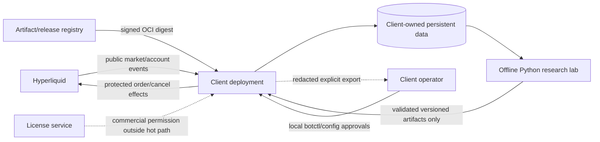
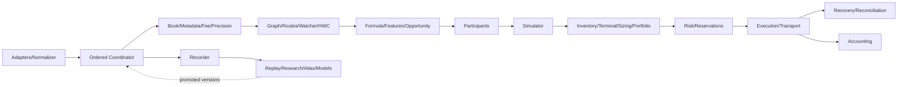
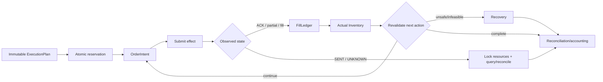
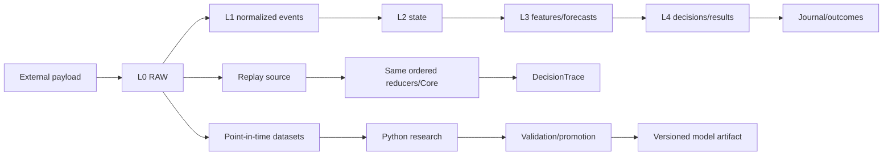
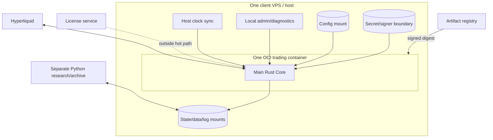

# 00 — Master Architecture

`DOCUMENTATION STATUS: REBUILD IN PROGRESS`

## 1. Purpose

This is the canonical entry point to the Hyperliquid arbitrage/routing system. It defines system boundaries, component and state ownership, ordered flows, failure containment and the navigation path into the domain masters. It summarizes but never overrides them.

## 2. System Mission

The product is a Hyperliquid spot arbitrage and routing engine with an initially same-venue strategy scope, venue-aware identities, deterministic Replay, constitutional Risk, stateful Execution, Recovery/Reconciliation, a Market Atlas, collective participant/survival models, counterfactual simulation, inventory/capital management and evidence-gated capability activation.

It is not merely an “arbitrage bot”: it is a stateful economic control system whose first obligation is to avoid creating or compounding exposure from stale, unknown or inconsistent state.

## 3. Authority and document hierarchy

Domain truth remains owned by its master and deep specs. The Formula Book owns mathematics; the Risk Constitution owns permission; Execution owns lifecycle state; Data owns truth/order/determinism; Validation owns evidence and maturity. This document owns only cross-domain orientation and architectural boundaries.

| Question | Owning master | Detail | Formula / validation |
|---|---|---|---|
| How does `NetConvert` work? | [Formula Book](04_FORMULA_BOOK.md), [Graph/Routes](03_MARKET_GRAPH_AND_ROUTES.md) | `deep-specs/formulas`, `deep-specs/market-graph` | QF-007–016 |
| What happens after a partial fill or UNKNOWN order? | [Execution](10_EXECUTION_STATE_MACHINE.md) | `deep-specs/execution` | QF-079–080; [Validation](16_VALIDATION_MATRIX.md) |
| When is an action permitted? | [Risk](09_RISK_CONSTITUTION.md) | `deep-specs/risk` | [Capability/Maturity](16_VALIDATION_MATRIX.md) |
| How are collective participants modelled? | [Participants](06_MARKET_PARTICIPANTS.md) | `deep-specs/participants` | QF-044–055, 081–083, 094–103 |
| How do Replay and Simulator differ? | [Recorder/Replay](12_RECORDER_AND_REPLAY.md), [Simulator](07_COUNTERFACTUAL_SIMULATOR.md) | `deep-specs/recorder-replay`, `deep-specs/simulator` | M2/M3/M4 evidence |
| How is capital sized or moved? | [Inventory/Capital](08_INVENTORY_AND_CAPITAL.md) | `deep-specs/inventory-capital` | QF-064–080, 105–108 |
| How is the client product deployed? | [Deployment](14_DEPLOYMENT_AND_DOCKER.md), [Infrastructure](13_INFRASTRUCTURE.md) | `deep-specs/deployment-security`, `deep-specs/infrastructure` | Deployment validation |
| When can a capability scale? | [Validation](16_VALIDATION_MATRIX.md), [Roadmaps](17_IMPLEMENTATION_ROADMAP.md), [Evidence Journey](19_BUILD_VALIDATE_SCALE_ROADMAP.md) | `deep-specs/validation`, `deep-specs/roadmaps` | M0–M5; `Q_validated` |

Authority conflicts are handled by the owning domain and [PASS 14](./_analysis/REBUILD_PLAN.md), never by silently changing this summary.

## 4. Current V1 scope

The initial product scope is Hyperliquid spot, same venue, with two-leg OWA and three-leg Triangle structures. TT is the first normal real-execution mode. TTT is activated only after TT and its own three-leg, intermediate-exposure and Recovery evidence. MT and MTT are later-V1 capabilities gated by maker evidence. TM/MM remain type-supported, default-disabled and capital-unvalidated.

“Supported by architecture” is not “enabled,” “validated” or “permitted for capital.” Exact active markets, routes, modes, models and q bands come only from the current `CapabilityManifest`, readiness and `RiskDecision` intersection.

## 5. Future scope

Cross-exchange routing, transfer edges, perpetual hedging (`perp hedge`), private-node activation, hot standby/HA, F4 interactive worlds, explicit participant agents, advanced ML, complex portfolio optimization and high-end infrastructure are Future/Research or evidence-gated. Venue-aware IDs and transport interfaces keep these extensions possible without making them V1 dependencies.

## 6. Architectural principles

1. `Safety > StateConsistency > ExistingExposure > RiskLimits > ExpectedPnL > Opportunity`.
2. `NetConvert` is the single canonical executable conversion primitive.
3. Edge and capacity are functions of size; visible depth and account balance are not validated capacity.
4. Know the universe broadly; spend expensive compute selectively where relevance and capital justify it.
5. Reserve shared resources before any order effect.
6. Exchange truth and unique actual fills define economic state.
7. Recovery and Reconciliation are first-class systems.
8. Replay, Paper, Shadow, MicroLive and Live preserve the same Core contracts.
9. Recorder and observability do not synchronously block the hot path.
10. Use final-capable interfaces from the start and activate progressively; no throwaway MVP.

The source shorthand “Know everything / expensive compute follows capital” means broad cheap awareness plus selective bounded computation; it does not let capital bypass HWC, capability or Risk. Operationally, the same Core spans Replay, Paper, Shadow, MicroLive and Live, while the Recorder is non-blocking. This is a final-capable architecture with progressive activation.

## 7. System context



The client owns account, signer and capital. There is no vendor custody and no centralized multi-tenant trading engine in the baseline.

## 8. Runtime topology

The initial runtime is a modular monolith: one main Rust process inside one client container, with strong logical module contracts and bounded asynchronous tasks/workers. The canonical ordered coordinator is the commit boundary for mutable Core state. Python runs separately/offline for research, training, calibration and reports. C++ is not baseline.

Tokio/async may implement I/O and bounded concurrency, but runtime-library types are not domain contracts. One logical module does not imply one process or microservice. See [Runtime Process Topology](./_analysis/pass13_master_architecture/RUNTIME_PROCESS_TOPOLOGY.md).

## 9. Domain/component map



The exact catalog and per-component contract are in [Component Catalog](./_analysis/pass13_master_architecture/COMPONENT_CATALOG.md).

## 10. State ownership

Each canonical mutable state family has one logical writer: Book, Metadata, Fee, Graph, Atlas, Feature, Account, Inventory, Reservation, Risk, Execution, Recovery, Reconciliation, Capability, Recorder, ModelArtifact and InfrastructureHealth. Readers consume immutable versioned snapshots. Strategy never owns a private account balance; Risk never owns a second inventory; Execution never invents fills; Capital never ignores reservations.

Parallel workers return results tagged with input versions. A stale worker result is discarded or revalidated before commit. Persistence supports reconstruction; it is not a second mutable runtime truth. See [State Ownership Matrix](./_analysis/pass13_master_architecture/STATE_OWNERSHIP_MATRIX.md).

## 11. Event / Command / Effect model

- A command or intent requests a deterministic state transition or external action.
- An event records an observation that happened.
- An effect is the Core’s request to an external executor.

`SubmitOrder` intent/effect is not `OrderAccepted`; acceptance is not a fill. Adapters and transports translate schemas and execute effects but cannot grant Risk permission or mutate domain state directly. Their observations return as ordered events.

## 12. Ordered core / reducers

```text
External or Replay payload
→ adapter/normalizer
→ ordered EngineInputEvent
→ pure state reducers under one logical coordinator
→ immutable versioned snapshots
→ bounded decisions and effect requests
→ EffectExecutor / transport
→ observed result event
→ ordered reducer commit
```

Core ordering follows receive chronology and `recorder_seq` within a capture context; exchange time remains source chronology. Each canonical state transition uses its deterministic `EventReducer`; external actions use the separate `EffectExecutor`. Determinism is independent of worker completion order and map iteration.

## 13. Hot path

The opportunity-to-order path is: valid market event → Book update → affected `pair_to_routes` lookup → cheap BBO/filter gates → exact size-dependent `NetConvert` → required bounded features/forecasts/Simulator fidelity → terminal/inventory effects → feasible size curve and allocation → staged Risk gates → atomic reservation → immutable `ExecutionPlan` → order effect.

All inputs are in-memory, versioned and freshness checked. Work is bounded by affected routes, configured q grids and activated capabilities. No generic graph traversal, large Monte Carlo, history scan, training, synchronous disk/database, object storage, license call, remote admin or log flush may sit on this path.

## 14. Async / research path

Recorder writes, compression, archive transfer, historical Replay jobs, Atlas slow aggregation, infrastructure analytics, diagnostics, license/release checks, reports, model training and Challenger evaluation are asynchronous/background/offline. Results re-enter the Core only as validated, immutable artifacts or atomic versioned configuration/capability changes—never through uncontrolled shared-memory mutation.

## 15. Market data pipeline

Hyperliquid market/account payloads are first captured as immutable RAW, then normalized into typed events. Ordered reducers produce coherent Book/Account/Metadata/Fee/Precision state. Gaps, stale data, unknown event types or invalid rules cannot mutate usable state. Feed and account adapters expose provenance, connection health and versioned semantics.

## 16. Graph / Routes

Metadata defines venue-aware asset locations, markets and two directed conversion edges per spot market. The structural Graph answers what can exist. Topology changes precompute fixed `DirectRoute`, `Route2Leg` and `Cycle3Leg` definitions and the `pair_to_routes` reverse dependency index. Capital/HOT state changes reachability or activation, never structural truth. Generic graph search is offline/Future, not per tick.

## 17. Quant / Formula Core

The Formula Book owns QF-001–QF-110, units, sign conventions, failures and golden/parity rules. `NetConvert(q)` walks exact L2, applies current fee/precision/minimum rules in the canonical order and returns typed economic outputs. No “simple price” shortcut may diverge. `Edge(q)`, profitable capacity, `Q_validated`, tail risk and accounting remain distinct formula concepts.

## 18. Opportunity Engine

Opportunity owns current candidate detection and reject episodes. It combines coherent route/book/rule versions with direct, indirect or cycle economics. BBO may reject cheaply but never accept in place of L2. It does not authorize capital, execute orders, train models or own accounting.

OWA requires a fair direct A→B comparator for the same input, terminal asset and conventions. Without it, A→X→B is not OWA and may only be a Bridge/relocation candidate. Triangle is A→X→B→A and returns to the start asset. `ConversionAlpha` and `ExecutionAlpha` remain separate.

## 19. Participants / Survival

The Participant engine models collective edge survival, liquidity response, competition, sparse cross-market response and maker outcomes. It does not fabricate individual identities as production truth. A simple empirical Champion is the bootstrap baseline; GBDT and advanced models are Challengers/Research until promoted. Forecasts carry artifact, support, horizon, confidence/OOD and source-state versions.

## 20. Counterfactual Simulator

The Simulator returns plausible execution outcome distributions, never an exact alternate universe. F0 Historical and F1 latency/mechanical behavior bootstrap; F2 queue and F3 responsive behavior activate only with evidence; F4 interactive agents remain Research. Mechanical `Δour`, historical compatibility and modeled response stay distinct. Low confidence can only narrow permission.

Replay reconstructs an event history through the Core; Simulator models counterfactual execution. They share types, states and formulas but remain different subsystems.

## 21. Inventory / Capital

Actual fills update Inventory immediately. `CORE_INVENTORY`, `TRANSIT` and `EXCLUDED` are classifications, separate from venue/location. Capital Reachability projects what can be used after balances, reservations and path costs; Terminal Viability checks the post-action inventory/exit/stranded state. Soft bands affect economics; hard bands are Risk gates.

Position Sizing selects total exposure from a nonlinear RAEV curve within every constraint. Order Slicing mechanically decomposes a fixed validated quantity. The Portfolio Allocator jointly selects among already eligible candidates under shared book, balance, inventory and Risk constraints; it never owns Risk.

## 22. Risk

Risk constructs the safe action set before economic optimization and revalidates at T0 detection, T1 pre-reservation, T2 pre-send, T3 after each fill, T4 before each next leg and T5 while maker liquidity rests. The hierarchy is Global → Inventory/Allocation → Route → Leg → Order. Higher layers can narrow but never relax lower safety.

`RiskDecision` is structured and reasoned: `ALLOW`, reduced-size/recovery-only variants, reject or scoped halts. There is no opaque score that means “execute.” Risk decisions expire or become invalid when material state/model/config/formula/capability versions change.

## 23. Reservations

Reservations atomically claim available balance, book capacity and risk/inventory capacity before an order effect. `UNKNOWN` ownership remains locked. Reservation release follows observed terminal/reconciled facts, not send/cancel intent. This prevents double spending across concurrent routes and portfolio actions.

## 24. Execution

Risk-approved input becomes an immutable `ExecutionPlan`. Five state families remain separate: `EngineState`, `RouteExecutionState`, `OrderState`, `RecoveryState`, `ReconciliationState`. TT, TTT, MT and MTT share the same actual-output rule; TM/MM remain disabled unless separately validated.



## 25. Recovery / Reconciliation

Recovery acts on known current exposure, not the planned route or sunk cost. It can choose bounded, Risk-approved current exits—including split exits—and may accept negative immediate EV to reduce exposure safely. Failure/exhaustion leads to containment and manual escalation, never an unbounded loop.

Reconciliation establishes exchange truth in the order orders → fills → balances and is mandatory for startup, UNKNOWN state, reconnect, crash, update, rollback and relevant incidents. Startup reconciliation always precedes readiness. `SENT` may have executed; cancel requested is not canceled; the invariant is ACTUAL FILL ONLY: only unique actual fills alter economic state.

## 26. Accounting

Accounting consumes unique actual fills, fees, inventory valuation and classified capital actions. It attributes Strategy/Route, Execution cost, Recovery, Inventory MTM, Rebalance, Bridge/Relocation, Infrastructure and idle-capital components without double counting. Forecast penalties never silently become realized PnL.

## 27. Recorder / Replay

Data is layered: L0 immutable RAW; L1 normalized events; L2 canonical state; L3 derived features/forecasts; L4 decisions/results. Recorder priority preserves fills/account/execution and incident evidence before general market data and derived diagnostics. Recorder non-blocking behavior is mandatory. The Execution Journal is distinct from broad RAW.



`DecisionTrace = F(OrderedEvents, ResolvedConfig, ModelArtifacts, FormulaVersion, Seed)`. Wall, monotonic, exchange and Replay logical time remain distinct. RNG is explicit in `RunManifest`; no lookahead or hidden randomness is permitted.

## 28. Market Atlas / HWC

The Atlas aggregates point-in-time market, route, asset, capital-location, regime, opportunity and execution evidence. It answers what is economically interesting, while the Graph answers what structurally exists. HWC is a reversible compute/relevance policy: COLD is still known, WARM receives confirmation, HOT receives bounded expensive evaluation. HOT never means Risk-safe.

The Global Watcher cheaply observes broad metadata/BBO/freshness/anomalies and proposes COLD→WARM promotion. Slow Atlas and capital-relocation decisions carry versions/hysteresis and remain outside the microsecond decision path.

## 29. Models / Champion-Challenger

Production Rust inference consumes only approved versioned artifacts. Recorder/live evidence → point-in-time dataset → offline Python training/calibration → temporal OOS/walk-forward validation → Challenger → explicit promotion → immutable artifact → bounded inference → predicted-versus-actual monitoring → fallback/demotion/retraining. A new artifact cannot mutate active behavior merely by existing.

## 30. RunModes

| Mode | Market/account source | Transport/effect | Real orders/capital | Clock | Risk / capability |
|---|---|---|---|---|---|
| Replay | Recorded ordered events | Recorded/simulated | No | `ReplayClock` | Same Core; M2 scope |
| Paper | Live or replay market; synthetic account | Paper transport | No | Mode-appropriate | Same Risk contracts; no fill claim |
| Shadow | Live inputs; shadow account projection | No-effect transport | No | Live monotonic/wall | M3 exact scope |
| MicroLive | Live market/account | Real protected transport | Probe only | Live clocks | M4 predeclared scope |
| Live | Live market/account | Real protected transport | Validated bounded | Live clocks | M5 exact reversible scope |

Modes vary event source, transport, clock and permission—not strategy equations, reducer semantics or failure shortcuts.

## 31. CapabilityManifest / maturity

Effective authority is the intersection of compiled support, configured RunMode/feature, release channel, license, exact `CapabilityManifest`, current readiness and per-action Risk permission. Missing coverage fails closed. M0 SPECIFIED, M1 UNIT VALIDATED, M2 REPLAY VALIDATED, M3 SHADOW VALIDATED, M4 MICRO-LIVE VALIDATED and M5 LIVE VALIDATED are capability-scoped and reversible. A capability cannot exceed its least-mature critical dependency.

## 32. Validation and evidence

Evolution follows `Specification → Implementation → Evidence → Validated Capability → Capital`. Unit/golden/property, integration, Replay, fault, load/performance, Shadow, Micro-live and operational evidence each prove different claims. Negative evidence is retained. Promotion is explicit; drift, OOD, incidents, rule/host/version change or loss of support can demote or shrink q immediately.

## 33. Operations / incidents

Operations observes liveness, readiness, trading health, data, Risk, Execution, Recovery, models, capital and infrastructure; it does not define trading semantics. Incident flow is fault → alert → scoped automatic safety action → evidence preservation → diagnosis → Recovery/Reconciliation → fix/rollback → revalidation → explicit capability resume. A cleared alert or deployed fix never auto-restores Live.

## 34. Infrastructure

The initial hypothesis is one lightweight Tokyo VPS using the public Hyperliquid feed, with a light local Recorder only if stress testing validates isolation. Region, provider, CPU/RAM/disk, container network and thresholds remain calibrated/open. Infrastructure promotion follows measured survival/capture, `InfraLostPnL`, `NetUpgradeValue`, ROI/LCB and reliability—not balance size or marketing.

## 35. Deployment / client isolation



Each client deployment isolates VPS/container/account/signer/capital/config/data/log/license context: clients own account, own signer and own capital. No shared central process holds all client keys. Public feed is baseline; a node and any shared-feed service require a later trust/availability/product design.

## 36. Security / licensing

The OCI runtime is minimal, digest-pinned, non-root and read-only with explicit mounts, dropped capabilities, no privileged mode, no Docker socket, no host-root/host-PID access and no clock-setting authority. Secrets stay outside the image/log/export/vendor boundary and use least privilege without withdrawal authority.

Licensing is commercial permission, not exchange truth, Risk or Recovery authority. The license outside hot path rule prevents remote entitlement availability from becoming an execution dependency. Invalid/expired licensing blocks new commercial risk but retains safe cancel, reconciliation, bounded Recovery, shutdown and client-data access where possible. Container isolation does not protect against malicious host root.

## 37. Update / rollback

Safe update and rollback are economic-state transactions: risk-off → resolve/resting-order handling → coherent persistence/evidence → owner handoff → artifact verify/replace → non-ready boot → sync/reconcile → readiness → explicit capability restoration. Rolling software back never rolls the exchange back. Two hosts/containers/versions may never be active economic owners of one account context.

## 38. Dependency DAG

The synchronous decision DAG is acyclic. Apparent cycles are staged: Opportunity episodes train Participants offline; Simulator evaluates q candidates and Sizer selects; Atlas consumes historic capital outcomes and emits later versions; Recovery proposes under Risk and Execution applies a new plan; Validation emits manifests outside runtime; runtime only reads current versions.

Data feedback loops are allowed only through ordered events, datasets, reports, artifacts and controlled promotion. See [Architecture Dependency DAG](./_analysis/pass13_master_architecture/ARCHITECTURE_DEPENDENCY_DAG.md).

## 39. Failure containment

Uncertainty reduces activity. Stale Book disables affected market/routes; unknown fees/precision prohibit affected new risk; model OOD falls back/shrinks/disables; UNKNOWN orders lock resources and reconcile; unsafe infrastructure forbids new risk; license loss preserves safety actions. Scope is the narrowest proven-safe Global/Venue/Market/Route/Strategy/Mode/Model/Infrastructure/Client scope; ambiguous shared truth widens containment.

Fail-closed applies to new risk. Cancel, Recovery, Reconciliation, evidence preservation and safe shutdown remain available when possible. See [Failure Containment Matrix](./_analysis/pass13_master_architecture/FAILURE_CONTAINMENT_MATRIX.md).

## 40. Build/Validate/Scale relation

The 26 technical phases build producer/consumer contracts; the 21 evidence stages establish which claims are defensible. Deployment and Operations are cross-cutting prerequisites rather than a renumbered technical phase. Initial no-capital and first probe slices are defined in PASS 12. This architecture does not authorize implementation or capital.

## 41. Current vs Future architecture

Current/Core interfaces cover the Rust modular Core, public-feed adapters, deterministic Recorder/Replay, Graph/routes/formulas, constitutional Risk, ESM/Recovery/Reconciliation and TT-first validation. Later V1 adds validated TTT, Participants, F2/F3, MT/MTT, Portfolio and Bridge by manifest scope. Future includes cross-exchange/perp/node/standby/F4/agents and high-end infra. See [Current V1 vs Future](./_analysis/pass13_master_architecture/CURRENT_V1_VS_FUTURE_ARCHITECTURE.md).

## 42. Cross-domain invariants

No stale Book for new risk; no unknown fee/precision; no double spending; reserve before order; no blind retry; actual fills only; cancel sent is not cancel confirmed; SENT may have executed; UNKNOWN locks reservations; reconcile before new risk; Recovery remains available; no hard-Risk bypass; no lookahead; same Core across RunModes; no hot-path disk; no silent model/formula/config version change; more capital does not expand `Q_validated`; Strategy, Bridge, Rebalance and Recovery remain distinct; Sizing differs from Slicing; Graph differs from Atlas and HWC; implemented/licensed/container-running differ from validated/ready; software rollback differs from exchange truth; no dual active owner.

Exact wording, owner and violation response are cataloged in [Cross-domain Invariants](./_analysis/pass13_master_architecture/CROSS_DOMAIN_INVARIANT_CATALOG.md).

## 43. Open / calibrated items

Open IDs remain `OPEN-001..016` plus formula `OPEN-017..028`, under their existing owners. They cover provider/region/network, thresholds, ROI estimator, node, Risk/model/inventory/survival, retention, maker activation, cross-exchange, licensing, telemetry, HWC/support and source-omitted formula conventions. Current Hyperliquid, platform and provider facts remain `EXTERNAL_REVALIDATION`.

PASS 13 freezes no Rust crate layout, channel type, database table, thread count, CPU pinning, container network mode, vendor or calibrated number. Remaining interface consistency questions are routed in [Architecture Gap Register](./_analysis/pass13_master_architecture/ARCHITECTURE_GAP_REGISTER.md) for PASS 14.

## 44. Deep-spec links

Architecture deep specs are indexed in [deep-specs/architecture/README.md](./deep-specs/architecture/README.md). Supporting analysis includes the [Requirement Ledger](./_analysis/pass13_master_architecture/ARCHITECTURE_REQUIREMENT_LEDGER.md), [Component Ownership](./_analysis/pass13_master_architecture/COMPONENT_OWNERSHIP_MATRIX.md), [Interfaces](./_analysis/pass13_master_architecture/DOMAIN_INTERFACE_CATALOG.md), [RunModes](./_analysis/pass13_master_architecture/RUNMODE_ARCHITECTURE_MATRIX.md), [Capability Activation](./_analysis/pass13_master_architecture/CAPABILITY_ACTIVATION_ARCHITECTURE.md) and [PASS 13 report](./_analysis/pass13_master_architecture/PASS13_FINAL_REPORT.md).

Changing a domain boundary, state owner, ordered-event rule, Risk priority, Execution truth model or RunMode equivalence requires architecture, domain and Validation impact review and a PASS-14-style consistency audit. No silent architecture drift is permitted.
