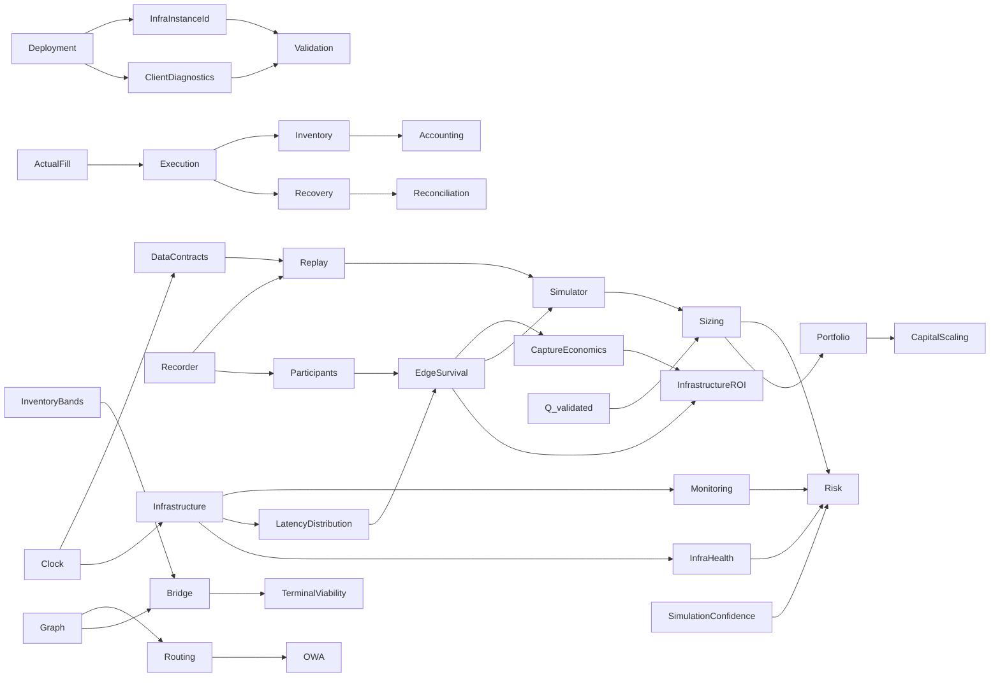

# Cross-domain Dependency Map

`DOCUMENTATION STATUS: REBUILD IN PROGRESS`

| Producer/concept | Consumers | Contract implication |
|---|---|---|
| ActualFill | Execution, Inventory, Recovery, Accounting, Replay | Actual exchange truth drives exposure |
| Clock | Data, Infrastructure, Replay, Simulator, Monitoring | Monotonic internal; synchronized wall clock + uncertainty cross-machine |
| EdgeSurvival | Participants, Simulator, Sizing, Infrastructure | Use latency distribution, not a scalar |
| Q_validated | Simulator, Risk, Sizing, Portfolio, scaling | Capital cannot exceed validated evidence |
| InventoryBands | Risk, Sizing, Bridge, Terminal Viability | Bands are calibrated and cannot bypass hard limits |
| SimulationConfidence | Simulator, Risk, Sizing | Low confidence reduces/refuses risk |
| OWA comparator | Routing, Formula, Bridge, Accounting | No valid direct comparator means Bridge/relocation, not OWA |
| InfraHealth | Risk, Execution, Operations | Unsafe infrastructure forbids new risk |
| LatencyDistribution / LatencyTrace | Participants, Survival, Simulator, InfrastructureROI | Infrastructure supplies measured distributions; PASS 02 owns competition/survival depth |
| InfraLostPnLRecord | Accounting, Simulator, Risk, InfrastructureROI | Versioned attribution and uncertainty; sequential marginal treatment prevents double count |
| RunManifest / InfraInstanceId | Benchmark, Deployment, Validation, Operations | Evidence is bound to material host/build/config; machine changes require revalidation |
| CaptureRatio / QF-093 | InfrastructureROI, Accounting, Participants | Aggregate sums, never naïve average of per-opportunity ratios |
| RecorderPenalty / storage health | Recorder, Infrastructure, Risk, Operations | Recorder must not materially disturb hot path; retention remains PASS 06 |
| FeedAdapter / feed health | Infrastructure, Data, Execution, Risk, Node future gate | Public feed first; node-compatible; feed semantics require revalidation |
| Client diagnostic | Deployment, Validation, Operations, InfrastructureROI | May recommend, never auto-purchase/migrate/authorize Live |
