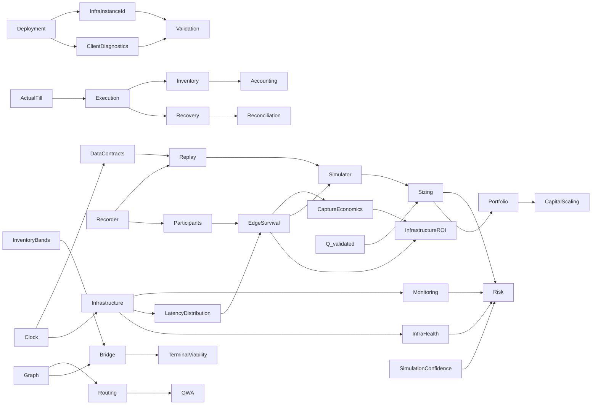

# Cross-domain Dependency Map

`DOCUMENTATION STATUS: AWAITING HUMAN REVIEW`

| Producer/concept | Consumers | Contract implication |
|---|---|---|
| ActualFill | Execution, Inventory, Recovery, Accounting, Replay | Actual exchange truth drives exposure |
| Clock | Data, Infrastructure, Replay, Simulator, Monitoring | Monotonic internal; synchronized wall clock + uncertainty cross-machine |
| EdgeSurvival | Participants, Simulator, Sizing, Infrastructure | Use latency distribution, not a scalar |
| Q_validated | Simulator, Risk, Sizing, Portfolio, scaling | Capital cannot exceed validated evidence |
| InventoryBands | Risk, Sizing, Bridge, Terminal Viability | Bands are calibrated and cannot bypass hard limits |
| SimulationConfidence | Simulator, Risk, Sizing | Low confidence reduces/refuses risk |
| OWA comparator | Routing, Formula, Bridge, Accounting | No valid direct comparator means Bridge/relocation, not OWA |
| InfraHealth | Risk, Execution, Operations | Unsafe infrastructure forbids new risk |
| LatencyDistribution / LatencyTrace | Participants, Survival, Simulator, InfrastructureROI | Infrastructure supplies measured distributions; PASS 02 owns competition/survival depth |
| InfraLostPnLRecord | Accounting, Simulator, Risk, InfrastructureROI | Versioned attribution and uncertainty; sequential marginal treatment prevents double count |
| RunManifest / InfraInstanceId | Benchmark, Deployment, Validation, Operations | Evidence is bound to material host/build/config; machine changes require revalidation |
| CaptureRatio / QF-093 | InfrastructureROI, Accounting, Participants | Aggregate sums, never naïve average of per-opportunity ratios |
| RecorderPenalty / storage health | Recorder, Infrastructure, Risk, Operations | Recorder must not materially disturb hot path; retention remains PASS 06 |
| FeedAdapter / feed health | Infrastructure, Data, Execution, Risk, Node future gate | Public feed first; node-compatible; feed semantics require revalidation |
| Client diagnostic | Deployment, Validation, Operations, InfrastructureROI | May recommend, never auto-purchase/migrate/authorize Live |
| OpportunityEpisode / censoring | EdgeSurvival, Validation, Recorder, Replay | Economic birth/death labels; right-censored endings; point-in-time provenance |
| MicrostructureFeatureSnapshot | Participants, Survival, LiquidityResponse, Maker, CrossMarket | Event OFI and Snapshot OFI proxy remain distinct; freshness/fidelity/version required |
| EdgeSurvivalForecast | Risk, Execution, Simulator, Sizing, Infrastructure, MarketAtlas | Survival, arrival-edge distribution, threshold probability, confidence and supported horizons |
| LiquidityForecast | Simulator, Risk, Execution, Sizing, Recovery, MarketAtlas | Future depth/replenishment/spread are distributions; no mechanical-impact double count |
| MakerForecast semantics | Execution, Risk, Simulator, Recovery | Fill-time/partial/adverse-selection forecasts; exact Data schema deferred to PASS 06 |
| CrossMarketForecast | Simulator, Risk, Execution, Recovery, MarketAtlas | Sparse response distribution; association is not causal proof; unsupported neighbour is not zero |
| ModelRegistry / ModelManifest | Participants, Data, Validation, Deployment, Operations | Artifact, feature schema, training window, support, metrics, fallback and approval are versioned |
| OOD / ModelDisagreement / ModelDrift | Risk, Sizing, Execution, Operations | Uncertainty can only reduce capability; model-dependent strategy kill/fallback |
| ParticipantResponseDistribution | Simulator | Participant produces calibrated stochastic inputs; Simulator owns Monte Carlo and counterfactual outcomes |
| ArrivalBook / HyperliquidExchangeEmulator | Simulator, Execution, Validation | Execute against simulated arrival state using the same authoritative rules/events as Live; current exchange facts require revalidation |
| ShadowBook / `Δour` | Simulator, Execution, Inventory, Accounting | Mechanical local mutation remains separate from baseline, actual account state, and probabilistic response |
| SimulationMode / ReplayFidelity | Simulator, Data, Risk, Validation | Exogenous/Interactive and F0–F4 are explicit independent provenance axes; low fidelity cannot claim omitted capabilities |
| BranchId / CounterfactualRejoinEvent | Simulator, Data, Replay, Validation | Incompatibility, branch horizon and rejoin are explicit; no silent snap to history |
| MakerForecast / Queue observability | Participants, Simulator, Execution, Risk | Participant supplies distributions; Simulator owns L2 queue scenarios; Execution owns real order/cancel states |
| ExecutionForecast | Simulator, Risk, Sizing, Execution | Full/partial/recovery/failure distribution, tails and confidence feed downstream gates; forecast does not authorize execution |
| RNG seed / TimerEvent / state hashes | Data, Replay, Simulator, Validation | Same contractual inputs reproduce traces and paths; strategic time and stochasticity are auditable |
| Simulator calibration health | Simulator, Risk, Operations, Validation | Persistent live contradiction reduces authority and feeds Simulator Calibration Kill Switch |
| ExecutionPlan / RiskDecision | Risk, Execution, Data, Replay | Only a current allowed decision becomes an immutable plan; material change creates a new version |
| ReservationState / QF-073–074 | Execution, Inventory, Risk, Sizing, Reconciliation | Balance/book/Risk capacity is reserved before orders; unknown capacity stays locked |
| CLOID / NonceManager / Signer | Execution, Data, Security, Reconciliation | Stable intent identity resolves ambiguous submits; nonce/signing exchange rules require external validation |
| OrderState / FillLedger | Execution, Inventory, Accounting, Recovery, Replay | Transport and economics remain separate; unique actual fills are immutable/idempotent truth |
| PendingIntermediateBuffer / DUST_EXPOSURE | Execution, Inventory, Risk, Accounting, Data | Small partials remain explicit exposure; compatibility and limits are calibrated by owning domains |
| RecoveryState / QF-079–080 | Execution, Risk, Graph, Routing, Inventory, Accounting | Best current bounded exit may split and may be negative EV; sunk costs never widen permission |
| ReconciliationState | Execution, Data, Account, Inventory, Risk, Operations | Orders then fills then balances establish consistency; unresolved truth blocks affected new risk |
| ExecutionTransport / RunMode | Execution, Replay, Simulator, Validation, Infrastructure | Same reducer/event schemas across Replay/Shadow/Micro-live/Live; effects and provenance differ explicitly |
| Safe action set `A_safe` | Risk, Strategy, Optimizer, Sizing, Execution | Hard failures remove actions before EV optimization; no downstream consumer may restore them |
| Risk gate pipeline | Data, Account, Inventory, Participants, Simulator, Execution, Portfolio | Exact 13-stage order; cheap eligibility precedes models/tails/optimizer and ends in pre-send revalidation |
| RiskDecision TTL / T0–T5 | Execution, Data, Clock, Maker, Recovery | A material version change or calibrated expiry forces a fresh immutable snapshot and authorization |
| Kill-switch taxonomy / dependency graph | Risk, Routing, Execution, Models, Infrastructure, Operations | Seven scope names; narrow safe isolation, conservative fallbacks and no automatic readiness after reset |
| RejectEvent / Reject Dataset | Risk, Data, Replay, Simulator, Validation | Accepted and rejected opportunities retain snapshot/reason/outcome evidence for unbiased calibration |
| RiskConfig / ResolvedConfig | Risk, Data, Execution, Deployment | Versioned effective policy is pinned per plan; exact standalone RiskConfig schema remains Data-owned |
| CapabilityManifest / ValidatedCapability | Validation, Risk, Execution, Deployment | Technical support is not Live permission; Risk refuses capability/size outside promoted evidence |

## PASS 06 — Data contract closures and remaining owners

| Data-produced contract | Consumers | Closure / remaining gap |
|---|---|---|
| RawEvent / NormalizedEvent / source quality | Feed, Book, Account, Replay, Validation | Envelope/time/lineage closed; exact current Hyperliquid wire semantics external |
| Canonical state versions / immutable snapshots | Strategy, Models, Simulator, Risk, Execution | Ownership/reducer contract closed; domain-specific state expansion remains owning pass |
| RunManifest / DecisionTrace | Every experimental/runtime domain | Frozen fields and determinism identity closed; deployment/research artifacts link without changing frozen schema |
| Ordering / Clock / RNG | Core, Replay, Simulator, Infrastructure | Local receive-order contract closed; cross-recorder merge/source-priority table calibrated/open implementation |
| Recorder priority/quality | Risk, Operations, Replay, Research | P0–P3 and invalid/low fidelity closed; exact queue/watermark thresholds calibrated |
| Journal/checkpoint/reconciliation | Execution, Account, Inventory, Operations | Recovery rule closed; PASS 04 owns state transitions, PASS 07 owns inventory details |
| Data lineage / point-in-time | Models, Participants, Simulator, Risk, Validation | Temporal contamination and counterfactual labeling closed |
| Retention/storage | Infrastructure, Deployment, Operations | Four classes and cleanup proof closed; provider/capacity/durations remain open/calibrated |

Cross-domain gaps retained: exact RiskConfig schema encoding; asset/mode/model/infra kill-event variants; rejected-opportunity realized-outcome linkage; full Inventory/Accounting/Portfolio schemas; deployment backup/restore runbooks; validation CapabilityManifest integration. No field was invented to pre-empt a future owning pass.

## PASS 07 — Inventory / Capital interfaces and remaining owners

| Producer/concept | Consumer | Closed PASS07 contract / remaining owner |
|---|---|---|
| Actual fills/account truth | Inventory, Capital, PnL | PASS04/06 produce; PASS07 gives economic meaning and immediate fill-derived update |
| Hard inventory/max size/Risk budget | Sizer, allocator, Bridge | PASS05 owns bounds/permission; PASS07 optimizes only inside them |
| Execution distributions/SimulationConfidence | Position Sizing | PASS03 supplies size/mode distributions; PASS07 consumes without a second simulator |
| Participant forecasts | Sizing, capital utility | PASS02 supplies survival/liquidity/competition forecasts; PASS07 consumes validated outputs |
| Market Graph/routes | Reachability, Bridge paths | PASS08 owns topology/routes/direct comparator; PASS07 owns capital implications only |
| Market Atlas/HOT-WARM-COLD | Relocation evidence | PASS08 owns definitions/tiers; PASS07 requires point-in-time opportunity/capacity/exit/utility outputs |
| QF-064–080/QF-105–108 | Inventory/Capital/Accounting | SRC-004/Formula Index authority; PASS11 audits expression extraction and units |
| Reservations | Sizing/portfolio/Bridge/Rebalance/Recovery | PASS04 owns mechanics; PASS07 defines joint economic demand/priority |
| Inventory/Capital/PnL schemas | Replay/Accounting | PASS06 frozen bases consumed; field expansions require Data schema governance, not ad hoc PASS07 mutation |

PASS07 gaps intentionally retained: PASS08 route/Atlas field finalization; PASS11 Formula Index expression/unit corrections; exact inventory/relocation/sizing/allocation parameters under validation; any Data schema expansion through the Data owner.

## PASS 08 — Graph / Routes / Atlas / Quant interfaces

| Producer/concept | Consumers | Closed PASS08 contract / remaining owner |
|---|---|---|
| Metadata → directed Graph | Route, Replay, Risk | venue-aware topology/version closed; current Hyperliquid schema external |
| RouteDefinition / `pair_to_routes` | Opportunity, Execution, Replay | fixed precomputed route families, reverse dependency and invalidation closed |
| Book/Feature state | Route economics, Participants, Risk, Atlas | current versioned state/feature semantics closed; PASS06 owns schemas |
| NetConvert / QF-007–016 | all conversion consumers | single directed L2/fee/precision semantic contract closed; PASS11 audits equations/units |
| Direct/indirect/Triangle outputs | OWA, Accounting, Sizing | QF-017–023 classification/terminal units closed |
| ConversionAlpha / ExecutionAlpha | Strategy, Execution, Simulator | QF-024 structural and QF-025 mode advantage remain separate |
| Edge(q) / QF-027 | PASS07 Sizing | profitable size closed as route input; QF-076 remains PASS07 all-gates owner |
| HWC / Route Activation | Compute, Capital, Risk | reversible selective-compute policy closed; thresholds calibrated |
| Market Atlas | HWC, Capital, Risk, research | field/evidence/version boundary closed; learned models/support remain validation-owned |
| Participant forecasts | Atlas, Opportunity, Simulator | PASS02 owns survival/response/replenishment/competition models |
| Point-in-time Graph/Atlas | Replay, DecisionTrace | no-lookahead/version contract closed; persistence/schema PASS06-owned |

Remaining gaps are explicit: current exchange metadata/fee/L2 rules; exact HWC/window/score calibrations; PASS11 exact Formula audit; future cross-exchange/transfer architecture; any serialized field expansion through PASS06 governance.

## PASS 09 — Deployment / Security interfaces

| Producer/concept | Consumers | Closed PASS09 contract / remaining owner |
|---|---|---|
| DeploymentManifest | Data RunManifest, Validation, Operations, Support | Installation/image/config/model/start identity closed; PASS06 RunManifest meaning unchanged |
| ResolvedConfig/config hash | Risk, Execution, Data, Replay | External read-only config and fail-closed compatibility closed; schema encoding remains Data-governed |
| Secret/signer boundary | Execution, Risk, Operations | No image/log/export/vendor secret; current API-wallet/nonce permissions require external revalidation |
| Runtime hardening/host profile | Infrastructure, Risk, Validation | Non-root/read-only/no privileged/socket rules closed; exact resources/network/profile calibrated |
| Startup/readiness states | Execution, Risk, Operations | Boot is non-ready; sync/reconcile precede READY; state reducer remains Execution-owned |
| Persistent mount/backup boundary | Data, Recorder, Execution, Operations | Replaceable image and protected economic evidence closed; formats/retention remain PASS06-owned |
| Capability intersection | Validation, Risk, Execution, Licensing | Compiled/configured/licensed/channel/validated/readiness/Risk remain separate; PASS10 promotes evidence |
| License failure envelope | Risk, Execution, Operations | New risk blocked when invalid; cancel/reconcile/Recovery/read access preserved |
| Update/rollback/host move | Execution, Data, Risk, Operations | Risk-off/resolve/backup/owner handoff/reconcile closed; runbook/tooling remains Operations/implementation |
| Active owner | Execution, Security, Recovery | One Live process; ambiguity blocks new risk; future distributed fencing remains FUTURE |
| `botctl`/diagnostic bundle | Operations, Security, Client support | Local idempotent operator surface and redaction boundary closed; final CLI/API and backend remain future work |
| Release provenance/channel | Validation, Operations, Client deployment | Development/Candidate/Stable and promotion sequence closed; exact signing/scanning/registry tooling OPEN |

PASS09 gaps intentionally retained: PASS10 CapabilityManifest/evidence promotion; Operations runbooks/telemetry backend; PASS11 formula compatibility audit; current exchange/runtime/provider facts; exact commercial license policy; future hot-standby fencing. No prior master was materially rewritten.

## PASS 10 — Validation / Operations closure interfaces

| Producer/concept | Consumers | Closed PASS10 contract / remaining owner |
|---|---|---|
| Maturity level / dependency ceiling | every capability, Risk, release | scoped M0–M5 and minimum critical-dependency maturity closed; evidence values remain empirical |
| CapabilityManifest / ValidatedCapability | Deployment, Risk, Execution, Operations | source-backed fields and fail-closed scope intersection closed; serialized expansion remains Data-governed |
| EvidenceId / validation report | every domain, incident, release | immutable reproducible evidence package semantics closed; storage/tool implementation remains future work |
| Replay/Shadow/Micro-live boundary | Models, Simulator, Execution, Sizing, Release | what each layer can and cannot prove closed; capital authority remains Risk/operator decision |
| Predicted-versus-actual dataset | Models, Simulator, Execution, Recovery, Accounting | joins, slices, distribution/tail reporting and append-only comparison closed |
| Q_validated promotion/demotion | Sizing, Capital, Portfolio, Risk | evidence-gated expansion and immediate shrink closed; numeric bands require calibration |
| Health/liveness/readiness | Deployment, Execution, Risk, client operations | distinct semantics and no persisted/automatic READY closed |
| Metrics/alerts/SLOs | Risk, Operations, Validation, Incident | required families, P0–P3 meaning and locked safety actions closed; thresholds/backend calibrated/open |
| Runbook / IncidentId / evidence package | Execution, Data, Deployment, Security, Support | reconciliation-first operational response, timeline and redaction boundary closed |
| Operational review/revalidation | Models, Infra, Release, Capital | trigger classes and reversible M5 closed; exact calendar cadence calibrated |

Remaining PASS10 cross-domain gaps: PASS11 exact formula/unit audit; PASS12 implementation journey; current exchange/platform/security external facts; telemetry/paging/dashboard/tool choices; sample minima, thresholds, windows and final serialized evidence/manifest schema through their owners.

## PASS 11 — Formula dependencies and remaining owners

| Producer/concept | Consumers | Closed PASS11 contract / remaining owner |
|---|---|---|
| QF-001–043 deterministic market math | Graph, Quant, Simulator, Risk, Execution | equations/units/signs/failures closed; current exchange precision/fees/minimums external |
| QF-044–055 learned survival/maker interfaces | Participants, Simulator, Execution, Infra | mathematical targets/functionals closed; artifacts, horizons and censor/tail estimators Validation-owned |
| QF-056–063 outcome/tail/RAEV | Simulator, Risk, Sizing | sign/scenario/cost ownership closed; empirical VaR/ES estimator and calibrated penalties open |
| QF-064–080 inventory/capital/sizing/recovery | Inventory, Bridge, Portfolio, Risk, Execution | objectives/gates/units closed; bands/search/solver parameters remain calibrated/open |
| QF-081–104 participants/infra/calibration/confidence | Participants, Infra, Model, Validation, Ops | like-for-like and status contracts closed; estimators/thresholds/evidence remain owner-controlled |
| QF-105–110 accounting/drawdown | Accounting, Inventory, Risk, Ops | disjoint identities/signs closed; zero-peak/empty-interval policy open |
| FormulaVersion/golden/parity | Data, Replay, Deployment, Validation | version/change invalidation and exact/tolerance split closed; serialized implementation remains Data/Build-owned |

The complete 27-item gap register is `pass11_formula_book/FORMULA_CROSS_DOMAIN_GAP_REGISTER.md`. PASS11 did not rewrite earlier masters or start implementation.

## PASS 12 — Roadmap dependency closure

| Producer / governing contract | Roadmap consumers | PASS 12 sequencing rule |
|---|---|---|
| Data types / adapters / Recorder | Book, Replay, all evidence and models | Capture begins before advanced consumers; invalid/unknown never becomes a usable default |
| Book / Metadata / Fee / Precision | Graph, Formula, Opportunity, Execution | Trusted state/rules precede economic or order claims |
| Graph / Formula Core | Opportunity, Recovery, Atlas, Sizing | Fixed precomputed structures and exact QF semantics precede candidate decisions |
| Replay / DecisionTrace | Every downstream domain | Same-Core deterministic/no-lookahead evidence precedes advanced model and Live claims |
| Account / Inventory / Reservations | Risk, Execution, Portfolio, Bridge | Actual fills and once-only shared-resource ownership precede capital effects |
| Risk / Execution SM / Transport / Recovery / Reconciliation | Shadow and Micro-live | Transport never grants permission; all safety/state capabilities are hard capital dependencies |
| Microstructure / Atlas / Simulator | Models, Sizing, capital and infra | Progressive baselines prevent evidence deadlock; missing support reduces authority |
| Participants / maker evidence | F2/F3, MT/MTT | Learned support is capability-specific; ALO/type support is not validation |
| Q_validated / CapabilityManifest | Every scale mode | Exact current evidence scope bridges implementation to possible capital |
| Operations / Deployment | Micro-live, Live, scaling | Safe owner/start/stop/reconcile/update/rollback and current health precede effects |

Remaining non-blocking PASS13/14 closure families: concrete module topology; serialized phase/evidence-artifact integration; explicit placement of deployment/operations work inside the 26-phase architecture; and final representation of capability-dependent model edges such as optional TTT Participant consumption. No hard dependency cycle remains.

| Gap ID | Cross-domain gap | Owner / required closure |
|---|---|---|
| `ROADMAP_CROSS_DOMAIN_GAP-001` | Concrete module/crate/process topology is intentionally not frozen by sequencing | PASS 13 Master Architecture |
| `ROADMAP_CROSS_DOMAIN_GAP-002` | Final serialized integration for phase/evidence artifacts extends existing Data contracts | PASS 13 interface map, then PASS 14 consistency/Data governance |
| `ROADMAP_CROSS_DOMAIN_GAP-003` | Deployment/Operations is a hard Micro-live workstream but not a separately numbered SRC-006 technical phase | PASS 13 must place it cross-cutting without renumbering the 26 phases |
| `ROADMAP_CROSS_DOMAIN_GAP-004` | Participant-model dependency is capability-manifest specific for TTT and other consumers | PASS 13 models dependency expression; PASS 14 verifies no circular gate |

All four are non-blocking for PASS 12 documentation and blocking only when their owning later pass/implementation boundary is reached.

## PASS 13 — Canonical architecture assembly

| Boundary | Producer → consumer rule | PASS 13 result |
|---|---|---|
| Core commit | adapter event → ordered coordinator → owning reducer → immutable snapshot | one logical writer; no private competing truth |
| Decision | Book/rules/Graph → Opportunity → optional forecasts/Simulator → terminal/sizing/allocation → staged Risk → reservation/plan | synchronous DAG; expensive work bounded and capability-specific |
| Execution | plan/reservation → transport effect → observed ACK/fill/UNKNOWN → reducers | transport grants no permission; actual fills only |
| Recovery | actual exposure → Recovery proposal → Risk → new Execution plan | staged producer/consumer boundary removes circular mutation |
| Replay/model | Recorder → point-in-time data/Replay/training → Validation → immutable artifact/capability → runtime snapshot | feedback is asynchronous and version-bounded |
| Atlas/capital | evidence → later AtlasVersion → reachability/viability/Bridge proposal | current decision pins Atlas version; no call cycle |
| Capability | evidence → Validation/CapabilityManifest → runtime intersection → Risk | implementation, license, readiness and validation remain independent narrowing axes |
| Deployment/Operations | cross-cutting phase prerequisites → readiness/health events | no renumbering of PASS12 phases and no hot-path control dependency |

Resolved: `ROADMAP_CROSS_DOMAIN_GAP-001`, `003`, `004`. Routed to PASS14: `ROADMAP_CROSS_DOMAIN_GAP-002` plus the Accounting-document authority, consolidated health vocabulary and Position-Sizer organizational boundary checks in `pass13_master_architecture/ARCHITECTURE_GAP_REGISTER.md`. Synchronous dependency cycles: **0**.

## PASS 14 — Audited final dependency closure

| Producer / owner | Contract | Principal consumers | PASS 14 result |
|---|---|---|---|
| adapters / ordered Core | Raw and normalized events | reducers, Recorder, Replay | producer and ordering verified |
| Book / Metadata / Fee / Precision | coherent versioned snapshots | Formula, Graph, Risk, Execution | producer, freshness and external-rule gates verified |
| Graph / Route | `RouteDefinition` | Opportunity, Replay, Execution | structural ownership verified; Atlas/Capital cannot mutate topology |
| Participants / Simulator | forecasts / `ExecutionForecast(q)` | Sizer, Risk, evidence | prediction remains distinct from actual exchange truth |
| Inventory / Capital / Sizer | actual state, reachability and bounded q proposal | Portfolio, Risk, Reservation, Accounting | Sizer ownership clarified; Risk remains final permission |
| Risk | `RiskDecision` | Reservation, Execution, Recovery, Operations | no hard-gate bypass; three-state `InfraState` consumer fixed |
| Execution / exchange evidence | plans/intents then order/fill events | reducers, Reconciliation, Recovery, Accounting | request is not event; actual-fill-only invariant verified |
| Data / Validation | RunManifest, DecisionTrace, EvidenceId, ValidationReport, CapabilityManifest | Replay, Deployment, Risk, Execution, Operations | `ROADMAP_CROSS_DOMAIN_GAP-002` closed by typed references without expanding frozen schemas |
| Infrastructure / Deployment / Operations | health, readiness and operational evidence | Risk, Execution, Validation | process state, readiness, alert severity and economic safety remain distinct |
| Validation / Capability Manager | exact scoped maturity and permission manifest | Deployment, Risk, Execution | license/release/config cannot promote capability |

Critical synchronous dependency cycles: **0**. Missing producers: **0**. Missing active consumers: **0**. Duplicate critical state owners: **0**. Unowned critical states: **0**. Remaining feedback loops are asynchronous and versioned; remaining `OPEN`/external dependencies are scoped in `pass14_cross_domain_consistency/RESIDUAL_CONSISTENCY_GAPS.md`.

## CORR-01 — Capture observability dependency overlay

| Producer / owner | New evidence contract | Consumers | Boundary preserved |
|---|---|---|---|
| Market Data / Graph | observation, reevaluation, cheap/exact evaluation and immutable Opportunity identities | Operations, Replay, Participants, Strategy | no dashboard or episode projector mutates topology/book/opportunity logic |
| offline/near-line episode projector | versioned `OpportunityEpisodeId`, censoring and membership | Participants, Research, Operations | not exchange truth, runtime gate or hot-path dependency |
| Simulator / Participants | frozen forecast bundle and label/horizon | Risk, Execution, Validation | prediction never becomes actual fill/completion |
| Sizing / Risk | bounded size disposition and immutable permission | Execution, funnel projection | observability cannot infer or grant allow |
| Execution / Recovery / Reconciliation | possible-send attempt, actual fills, state and final truth | Inventory, Accounting, Validation, Operations | projection changes no machine/transition |
| Accounting | complete attempt PnL and valuation status | Risk, Validation, Operations, Infra economics | partial components do not imply positive PnL |
| Data / Recorder | typed lineage, timing points, critical journal and projection versions | Replay, Operations, Validation | metric backend is not system of record; export never blocks Core |
| Validation / Operations | metric populations, joins, calibration, overhead and trial evidence | Capability/Infra/Review | no automatic promotion or new `p_full` gate |

Asynchronous cycle: actual outcomes train/calibrate later model versions only through Recorder/Research/Validation promotion. Synchronous critical cycles added: **0**.

## CORR-02 — Hot-path performance dependency overlay

| Producer / owner | Performance contract | Consumers | Boundary preserved |
|---|---|---|---|
| Book / ordered Core | valid versioned BBO/L2 state | Graph, NetConvert, workers | single writer and ordered truth unchanged |
| Graph / Route | reverse-index generation and canonical↔dense map | Opportunity, Replay, Operations | canonical IDs/topology authority retained |
| Formula / NetConvert | full-L2 oracle and exact eligible FastL1 result | Route economics, Validation | QF-016/FormulaVersion unchanged |
| Opportunity | C1–C4 disposition and complete evaluation tuple | Participants, Risk, evidence | C4 cannot reject; C3 ineligible falls back |
| Data / Replay | ordered events, versions, DecisionTrace | every optimization gate | distinct states not coalesced silently |
| Recorder / queues | bounded prioritized evidence handoff | Replay, Operations | queue does not own state; critical evidence retained |
| Infrastructure | controlled CPU/work/allocation/compiler benchmarks | Validation, Roadmap | technical evidence grants no economic permission |
| Validation | parity, Replay, Shadow, capture/economic reports | Capability/Review | no direct Live or capital promotion |
| Execution/Risk/Recovery/Accounting | canonical economic authority | future C++ review | excluded from first foreign-language candidates |

Synchronous critical dependency cycles added: **0**. Critical multi-writer states added: **0**. New QF or Risk gates: **0**. Any cross-event scheduling/coalescing proposal is outside transparent optimization and requires a new reviewed semantic version.
