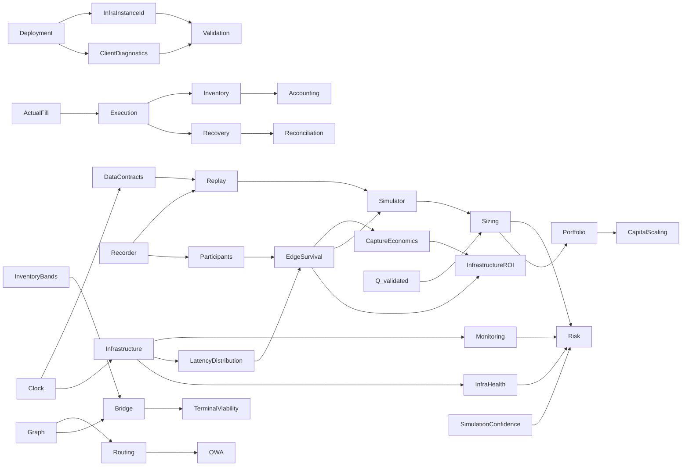

# Cross-domain Dependency Map

`DOCUMENTATION STATUS: REBUILD IN PROGRESS`

| Producer/concept | Consumers | Contract implication |
|---|---|---|
| ActualFill | Execution, Inventory, Recovery, Accounting, Replay | Actual exchange truth drives exposure |
| Clock | Data, Infrastructure, Replay, Simulator, Monitoring | Monotonic internal; synchronized wall clock + uncertainty cross-machine |
| EdgeSurvival | Participants, Simulator, Sizing, Infrastructure | Use latency distribution, not a scalar |
| Q_validated | Simulator, Risk, Sizing, Portfolio, scaling | Capital cannot exceed validated evidence |
| InventoryBands | Risk, Sizing, Bridge, Terminal Viability | Bands are calibrated and cannot bypass hard limits |
| SimulationConfidence | Simulator, Risk, Sizing | Low confidence reduces/refuses risk |
| OWA comparator | Routing, Formula, Bridge, Accounting | No valid direct comparator means Bridge/relocation, not OWA |
| InfraHealth | Risk, Execution, Operations | Unsafe infrastructure forbids new risk |
| LatencyDistribution / LatencyTrace | Participants, Survival, Simulator, InfrastructureROI | Infrastructure supplies measured distributions; PASS 02 owns competition/survival depth |
| InfraLostPnLRecord | Accounting, Simulator, Risk, InfrastructureROI | Versioned attribution and uncertainty; sequential marginal treatment prevents double count |
| RunManifest / InfraInstanceId | Benchmark, Deployment, Validation, Operations | Evidence is bound to material host/build/config; machine changes require revalidation |
| CaptureRatio / QF-093 | InfrastructureROI, Accounting, Participants | Aggregate sums, never naïve average of per-opportunity ratios |
| RecorderPenalty / storage health | Recorder, Infrastructure, Risk, Operations | Recorder must not materially disturb hot path; retention remains PASS 06 |
| FeedAdapter / feed health | Infrastructure, Data, Execution, Risk, Node future gate | Public feed first; node-compatible; feed semantics require revalidation |
| Client diagnostic | Deployment, Validation, Operations, InfrastructureROI | May recommend, never auto-purchase/migrate/authorize Live |
| OpportunityEpisode / censoring | EdgeSurvival, Validation, Recorder, Replay | Economic birth/death labels; right-censored endings; point-in-time provenance |
| MicrostructureFeatureSnapshot | Participants, Survival, LiquidityResponse, Maker, CrossMarket | Event OFI and Snapshot OFI proxy remain distinct; freshness/fidelity/version required |
| EdgeSurvivalForecast | Risk, Execution, Simulator, Sizing, Infrastructure, MarketAtlas | Survival, arrival-edge distribution, threshold probability, confidence and supported horizons |
| LiquidityForecast | Simulator, Risk, Execution, Sizing, Recovery, MarketAtlas | Future depth/replenishment/spread are distributions; no mechanical-impact double count |
| MakerForecast semantics | Execution, Risk, Simulator, Recovery | Fill-time/partial/adverse-selection forecasts; exact Data schema deferred to PASS 06 |
| CrossMarketForecast | Simulator, Risk, Execution, Recovery, MarketAtlas | Sparse response distribution; association is not causal proof; unsupported neighbour is not zero |
| ModelRegistry / ModelManifest | Participants, Data, Validation, Deployment, Operations | Artifact, feature schema, training window, support, metrics, fallback and approval are versioned |
| OOD / ModelDisagreement / ModelDrift | Risk, Sizing, Execution, Operations | Uncertainty can only reduce capability; model-dependent strategy kill/fallback |
| ParticipantResponseDistribution | Simulator | Participant produces calibrated stochastic inputs; Simulator owns Monte Carlo and counterfactual outcomes |
| ArrivalBook / HyperliquidExchangeEmulator | Simulator, Execution, Validation | Execute against simulated arrival state using the same authoritative rules/events as Live; current exchange facts require revalidation |
| ShadowBook / `Δour` | Simulator, Execution, Inventory, Accounting | Mechanical local mutation remains separate from baseline, actual account state, and probabilistic response |
| SimulationMode / ReplayFidelity | Simulator, Data, Risk, Validation | Exogenous/Interactive and F0–F4 are explicit independent provenance axes; low fidelity cannot claim omitted capabilities |
| BranchId / CounterfactualRejoinEvent | Simulator, Data, Replay, Validation | Incompatibility, branch horizon and rejoin are explicit; no silent snap to history |
| MakerForecast / Queue observability | Participants, Simulator, Execution, Risk | Participant supplies distributions; Simulator owns L2 queue scenarios; Execution owns real order/cancel states |
| ExecutionForecast | Simulator, Risk, Sizing, Execution | Full/partial/recovery/failure distribution, tails and confidence feed downstream gates; forecast does not authorize execution |
| RNG seed / TimerEvent / state hashes | Data, Replay, Simulator, Validation | Same contractual inputs reproduce traces and paths; strategic time and stochasticity are auditable |
| Simulator calibration health | Simulator, Risk, Operations, Validation | Persistent live contradiction reduces authority and feeds Simulator Calibration Kill Switch |
| ExecutionPlan / RiskDecision | Risk, Execution, Data, Replay | Only a current allowed decision becomes an immutable plan; material change creates a new version |
| ReservationState / QF-073–074 | Execution, Inventory, Risk, Sizing, Reconciliation | Balance/book/Risk capacity is reserved before orders; unknown capacity stays locked |
| CLOID / NonceManager / Signer | Execution, Data, Security, Reconciliation | Stable intent identity resolves ambiguous submits; nonce/signing exchange rules require external validation |
| OrderState / FillLedger | Execution, Inventory, Accounting, Recovery, Replay | Transport and economics remain separate; unique actual fills are immutable/idempotent truth |
| PendingIntermediateBuffer / DUST_EXPOSURE | Execution, Inventory, Risk, Accounting, Data | Small partials remain explicit exposure; compatibility and limits are calibrated by owning domains |
| RecoveryState / QF-079–080 | Execution, Risk, Graph, Routing, Inventory, Accounting | Best current bounded exit may split and may be negative EV; sunk costs never widen permission |
| ReconciliationState | Execution, Data, Account, Inventory, Risk, Operations | Orders then fills then balances establish consistency; unresolved truth blocks affected new risk |
| ExecutionTransport / RunMode | Execution, Replay, Simulator, Validation, Infrastructure | Same reducer/event schemas across Replay/Shadow/Micro-live/Live; effects and provenance differ explicitly |
| Safe action set `A_safe` | Risk, Strategy, Optimizer, Sizing, Execution | Hard failures remove actions before EV optimization; no downstream consumer may restore them |
| Risk gate pipeline | Data, Account, Inventory, Participants, Simulator, Execution, Portfolio | Exact 13-stage order; cheap eligibility precedes models/tails/optimizer and ends in pre-send revalidation |
| RiskDecision TTL / T0–T5 | Execution, Data, Clock, Maker, Recovery | A material version change or calibrated expiry forces a fresh immutable snapshot and authorization |
| Kill-switch taxonomy / dependency graph | Risk, Routing, Execution, Models, Infrastructure, Operations | Seven scope names; narrow safe isolation, conservative fallbacks and no automatic readiness after reset |
| RejectEvent / Reject Dataset | Risk, Data, Replay, Simulator, Validation | Accepted and rejected opportunities retain snapshot/reason/outcome evidence for unbiased calibration |
| RiskConfig / ResolvedConfig | Risk, Data, Execution, Deployment | Versioned effective policy is pinned per plan; exact standalone RiskConfig schema remains Data-owned |
| CapabilityManifest / ValidatedCapability | Validation, Risk, Execution, Deployment | Technical support is not Live permission; Risk refuses capability/size outside promoted evidence |

## PASS 06 — Data contract closures and remaining owners

| Data-produced contract | Consumers | Closure / remaining gap |
|---|---|---|
| RawEvent / NormalizedEvent / source quality | Feed, Book, Account, Replay, Validation | Envelope/time/lineage closed; exact current Hyperliquid wire semantics external |
| Canonical state versions / immutable snapshots | Strategy, Models, Simulator, Risk, Execution | Ownership/reducer contract closed; domain-specific state expansion remains owning pass |
| RunManifest / DecisionTrace | Every experimental/runtime domain | Frozen fields and determinism identity closed; deployment/research artifacts link without changing frozen schema |
| Ordering / Clock / RNG | Core, Replay, Simulator, Infrastructure | Local receive-order contract closed; cross-recorder merge/source-priority table calibrated/open implementation |
| Recorder priority/quality | Risk, Operations, Replay, Research | P0–P3 and invalid/low fidelity closed; exact queue/watermark thresholds calibrated |
| Journal/checkpoint/reconciliation | Execution, Account, Inventory, Operations | Recovery rule closed; PASS 04 owns state transitions, PASS 07 owns inventory details |
| Data lineage / point-in-time | Models, Participants, Simulator, Risk, Validation | Temporal contamination and counterfactual labeling closed |
| Retention/storage | Infrastructure, Deployment, Operations | Four classes and cleanup proof closed; provider/capacity/durations remain open/calibrated |

Cross-domain gaps retained: exact RiskConfig schema encoding; asset/mode/model/infra kill-event variants; rejected-opportunity realized-outcome linkage; full Inventory/Accounting/Portfolio schemas; deployment backup/restore runbooks; validation CapabilityManifest integration. No field was invented to pre-empt a future owning pass.

## PASS 07 — Inventory / Capital interfaces and remaining owners

| Producer/concept | Consumer | Closed PASS07 contract / remaining owner |
|---|---|---|
| Actual fills/account truth | Inventory, Capital, PnL | PASS04/06 produce; PASS07 gives economic meaning and immediate fill-derived update |
| Hard inventory/max size/Risk budget | Sizer, allocator, Bridge | PASS05 owns bounds/permission; PASS07 optimizes only inside them |
| Execution distributions/SimulationConfidence | Position Sizing | PASS03 supplies size/mode distributions; PASS07 consumes without a second simulator |
| Participant forecasts | Sizing, capital utility | PASS02 supplies survival/liquidity/competition forecasts; PASS07 consumes validated outputs |
| Market Graph/routes | Reachability, Bridge paths | PASS08 owns topology/routes/direct comparator; PASS07 owns capital implications only |
| Market Atlas/HOT-WARM-COLD | Relocation evidence | PASS08 owns definitions/tiers; PASS07 requires point-in-time opportunity/capacity/exit/utility outputs |
| QF-064–080/QF-105–108 | Inventory/Capital/Accounting | SRC-004/Formula Index authority; PASS11 audits expression extraction and units |
| Reservations | Sizing/portfolio/Bridge/Rebalance/Recovery | PASS04 owns mechanics; PASS07 defines joint economic demand/priority |
| Inventory/Capital/PnL schemas | Replay/Accounting | PASS06 frozen bases consumed; field expansions require Data schema governance, not ad hoc PASS07 mutation |

PASS07 gaps intentionally retained: PASS08 route/Atlas field finalization; PASS11 Formula Index expression/unit corrections; exact inventory/relocation/sizing/allocation parameters under validation; any Data schema expansion through the Data owner.
