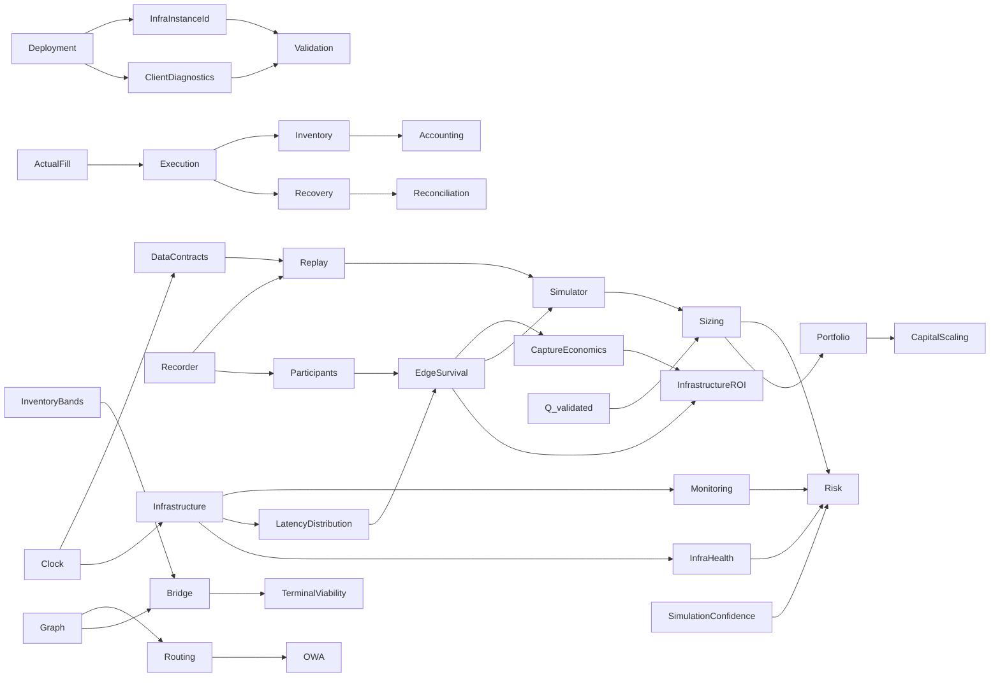

# Cross-domain Dependency Map

`DOCUMENTATION STATUS: REBUILD IN PROGRESS`

| Producer/concept | Consumers | Contract implication |
|---|---|---|
| ActualFill | Execution, Inventory, Recovery, Accounting, Replay | Actual exchange truth drives exposure |
| Clock | Data, Infrastructure, Replay, Simulator, Monitoring | Monotonic internal; synchronized wall clock + uncertainty cross-machine |
| EdgeSurvival | Participants, Simulator, Sizing, Infrastructure | Use latency distribution, not a scalar |
| Q_validated | Simulator, Risk, Sizing, Portfolio, scaling | Capital cannot exceed validated evidence |
| InventoryBands | Risk, Sizing, Bridge, Terminal Viability | Bands are calibrated and cannot bypass hard limits |
| SimulationConfidence | Simulator, Risk, Sizing | Low confidence reduces/refuses risk |
| OWA comparator | Routing, Formula, Bridge, Accounting | No valid direct comparator means Bridge/relocation, not OWA |
| InfraHealth | Risk, Execution, Operations | Unsafe infrastructure forbids new risk |
| LatencyDistribution / LatencyTrace | Participants, Survival, Simulator, InfrastructureROI | Infrastructure supplies measured distributions; PASS 02 owns competition/survival depth |
| InfraLostPnLRecord | Accounting, Simulator, Risk, InfrastructureROI | Versioned attribution and uncertainty; sequential marginal treatment prevents double count |
| RunManifest / InfraInstanceId | Benchmark, Deployment, Validation, Operations | Evidence is bound to material host/build/config; machine changes require revalidation |
| CaptureRatio / QF-093 | InfrastructureROI, Accounting, Participants | Aggregate sums, never naïve average of per-opportunity ratios |
| RecorderPenalty / storage health | Recorder, Infrastructure, Risk, Operations | Recorder must not materially disturb hot path; retention remains PASS 06 |
| FeedAdapter / feed health | Infrastructure, Data, Execution, Risk, Node future gate | Public feed first; node-compatible; feed semantics require revalidation |
| Client diagnostic | Deployment, Validation, Operations, InfrastructureROI | May recommend, never auto-purchase/migrate/authorize Live |
| OpportunityEpisode / censoring | EdgeSurvival, Validation, Recorder, Replay | Economic birth/death labels; right-censored endings; point-in-time provenance |
| MicrostructureFeatureSnapshot | Participants, Survival, LiquidityResponse, Maker, CrossMarket | Event OFI and Snapshot OFI proxy remain distinct; freshness/fidelity/version required |
| EdgeSurvivalForecast | Risk, Execution, Simulator, Sizing, Infrastructure, MarketAtlas | Survival, arrival-edge distribution, threshold probability, confidence and supported horizons |
| LiquidityForecast | Simulator, Risk, Execution, Sizing, Recovery, MarketAtlas | Future depth/replenishment/spread are distributions; no mechanical-impact double count |
| MakerForecast semantics | Execution, Risk, Simulator, Recovery | Fill-time/partial/adverse-selection forecasts; exact Data schema deferred to PASS 06 |
| CrossMarketForecast | Simulator, Risk, Execution, Recovery, MarketAtlas | Sparse response distribution; association is not causal proof; unsupported neighbour is not zero |
| ModelRegistry / ModelManifest | Participants, Data, Validation, Deployment, Operations | Artifact, feature schema, training window, support, metrics, fallback and approval are versioned |
| OOD / ModelDisagreement / ModelDrift | Risk, Sizing, Execution, Operations | Uncertainty can only reduce capability; model-dependent strategy kill/fallback |
| ParticipantResponseDistribution | Simulator | Participant produces calibrated stochastic inputs; Simulator owns Monte Carlo and counterfactual outcomes |
| ArrivalBook / HyperliquidExchangeEmulator | Simulator, Execution, Validation | Execute against simulated arrival state using the same authoritative rules/events as Live; current exchange facts require revalidation |
| ShadowBook / `Δour` | Simulator, Execution, Inventory, Accounting | Mechanical local mutation remains separate from baseline, actual account state, and probabilistic response |
| SimulationMode / ReplayFidelity | Simulator, Data, Risk, Validation | Exogenous/Interactive and F0–F4 are explicit independent provenance axes; low fidelity cannot claim omitted capabilities |
| BranchId / CounterfactualRejoinEvent | Simulator, Data, Replay, Validation | Incompatibility, branch horizon and rejoin are explicit; no silent snap to history |
| MakerForecast / Queue observability | Participants, Simulator, Execution, Risk | Participant supplies distributions; Simulator owns L2 queue scenarios; Execution owns real order/cancel states |
| ExecutionForecast | Simulator, Risk, Sizing, Execution | Full/partial/recovery/failure distribution, tails and confidence feed downstream gates; forecast does not authorize execution |
| RNG seed / TimerEvent / state hashes | Data, Replay, Simulator, Validation | Same contractual inputs reproduce traces and paths; strategic time and stochasticity are auditable |
| Simulator calibration health | Simulator, Risk, Operations, Validation | Persistent live contradiction reduces authority and feeds Simulator Calibration Kill Switch |
