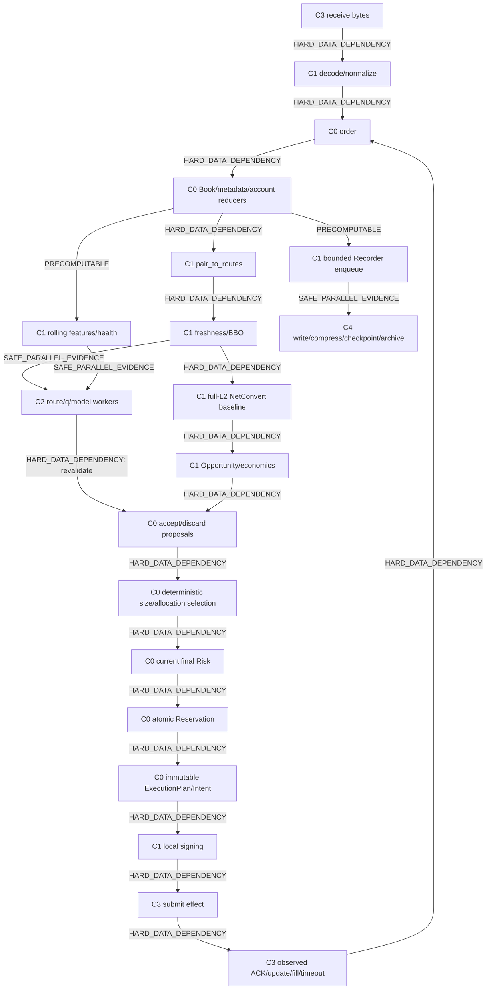

# Hot-Path Dependency DAG

`DOCUMENTATION STATUS: AWAITING FINAL HUMAN REVIEW`

## Edge types

- `HARD_DATA_DEPENDENCY`: downstream meaning requires the exact upstream result/current state.
- `SAFE_PARALLEL_EVIDENCE`: pure work may run concurrently from the same immutable snapshot; completion is only evidence/proposal.
- `PRECOMPUTABLE`: work can be incrementally maintained or prepared before the opportunity without using future knowledge.



## Leg dependency

```text
actual unique fill for Leg 1
  --HARD_DATA_DEPENDENCY--> current Inventory/Account/Reservation update
  --HARD_DATA_DEPENDENCY--> Risk revalidation
  --HARD_DATA_DEPENDENCY--> exact Leg 2 quantity/price/intent
```

Pure Leg 2 preparation—route lookup, rule lookup, template building, predicted scenarios—may run as `SAFE_PARALLEL_EVIDENCE`. It cannot select the executable quantity, authorize, sign or send Leg 2 before the actual prior fill is committed. The same rule applies recursively to TTT.

## Parallel regions

- Independent route or q calculations sharing an immutable version tuple may run concurrently.
- Optional Participant and F2/F3 Simulator computations may run concurrently with cheap baseline work.
- Recorder serialization, compression, checksums, archive and metrics aggregation run after a bounded handoff.
- None of these regions bypasses ordered proposal acceptance, current Risk or Reservation.

## Forbidden edges

- worker completion → direct order send;
- ACK callback → direct Execution mutation;
- predicted fill → later-leg executable quantity;
- background writer failure → silent evidence loss;
- remote model/license/archive response → synchronous hot-path permission;
- wall-clock thread order → canonical decision priority.
