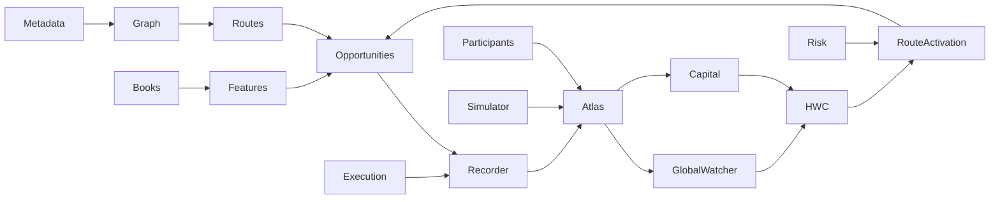

# Market Atlas Dependency Map

DOCUMENTATION STATUS:
REBUILD IN PROGRESS

## Ownership boundaries

| Flow | Contract |
|---|---|
| Graph → Atlas | structural identity/connectivity/status; Atlas cannot alter topology |
| Book/Feature → Atlas | versioned observations/aggregates; current BookState remains exchange truth |
| Opportunity/Execution → Atlas | detected, rejected, accepted and captured evidence remain distinct |
| Participants → Atlas | survival, response, replenishment and competition predictions retain PASS02 model provenance |
| Simulator → Atlas | predicted/counterfactual evidence is labelled and never mixed with actual outcomes |
| Atlas → HWC/Activation | ranked/calibrated context; no direct trading permission |
| PASS07 ↔ Atlas | Atlas exposes opportunity/exit context; Capital owns reachability, terminal viability, Bridge and `Q_validated` |
| Risk → Activation | capability may remove expensive/active evaluation; a high score never restores forbidden action |
| Recorder/Replay ↔ Atlas | immutable AtlasVersion, dataset/model/formula lineage and evidence available by T |

## Feedback control

`RECORD → ATLAS → capital placement research → HWC → execution evidence → RECORD` is observable but governed. WARM/COLD coverage, rejected-opportunity evidence, support/confidence and out-of-sample validation prevent capital concentration from becoming self-confirming blindness. Formula definitions never self-modify; only governed learned/calibrated parameters may be promoted.
