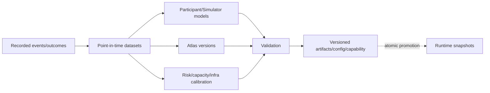

# Architecture Dependency DAG

`DOCUMENTATION STATUS: AWAITING HUMAN REVIEW`

## Synchronous decision DAG

```mermaid
flowchart LR
  A[Adapters/Normalizer/Clock] --> B[Ordered reducers]
  B --> S[Book + rules + account snapshots]
  S --> G[Graph/routes + features]
  G --> O[Opportunity/NetConvert]
  O --> P[Optional bounded Participant inference]
  P --> X[Configured Simulator]
  X --> T[Terminal/Inventory projection]
  T --> Z[Sizing]
  Z --> L[Portfolio allocation]
  L --> R[Risk]
  R --> V[Reservation]
  V --> E[Execution plan/effect]
```

Cheap Risk eligibility can terminate before expensive P/X/Z/L. Final T1/T2 gates occur after sizing/allocation and before reservation/send; later T3–T5 checks consume actual events. This staging is not a Risk bypass.

## Allowed asynchronous feedback

## Cycle resolutions

| Apparent cycle | Acyclic boundary |
|---|---|
| Participants ↔ Opportunity | Basic Opportunity records episodes; offline model version returns later |
| Sizing ↔ Simulator | Simulator evaluates declared q candidates; Sizer selects from returned curve |
| Atlas ↔ Capital | Capital outcomes feed a later AtlasVersion; a decision pins the current version |
| Recovery ↔ Execution | Recovery proposes a new Risk-approved plan; Execution alone applies effects |
| Validation ↔ Runtime | Runtime emits evidence; offline Validation publishes a later manifest |
| Risk ↔ Micro-live evidence | Conservative constitutional baseline permits only predeclared probe; evidence later calibrates narrower/wider scope |

Synchronous cycles found: **0**. Data-feedback loops are explicit, delayed and versioned.
