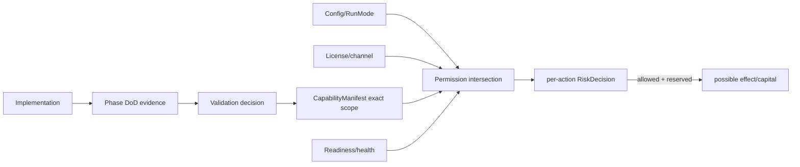

# Capability Activation Architecture

`DOCUMENTATION STATUS: AWAITING HUMAN REVIEW`

| Axis | Owner | Can widen another axis? | Failure response |
|---|---|---|---|
| Compiled/type support | Build/domain | No | unavailable |
| Configured enablement/RunMode | Deployment/operator | No | disabled |
| Release channel | Release/Validation | No | hold/rollback |
| License entitlement | Commercial/Deployment | No | no new commercial risk; safety remains |
| Validated capability | Validation/Capability Manager | No | missing exact scope fails closed |
| Readiness/health | Execution/Ops/Risk | No | scoped degradation/reconcile |
| Per-action Risk | Risk | Final narrowing authority | reject/reduce/recovery-only/halt |

The manifest covers strategy, markets/routes, mode, q range, model/artifact, validation level, restrictions and relevant build/config/formula/schema/infra identity. Maturity is capped by critical dependencies. Optional dependencies are explicit: a TTT capability that consumes a Participant model lists it; basic TTT does not acquire a universal advanced-model gate.

Promotion never follows elapsed time, profitability alone, code availability, licensing or a cleared alert. Valid actions include promote, hold, shrink, fallback, suspend, demote and disable. M5 remains reversible.
