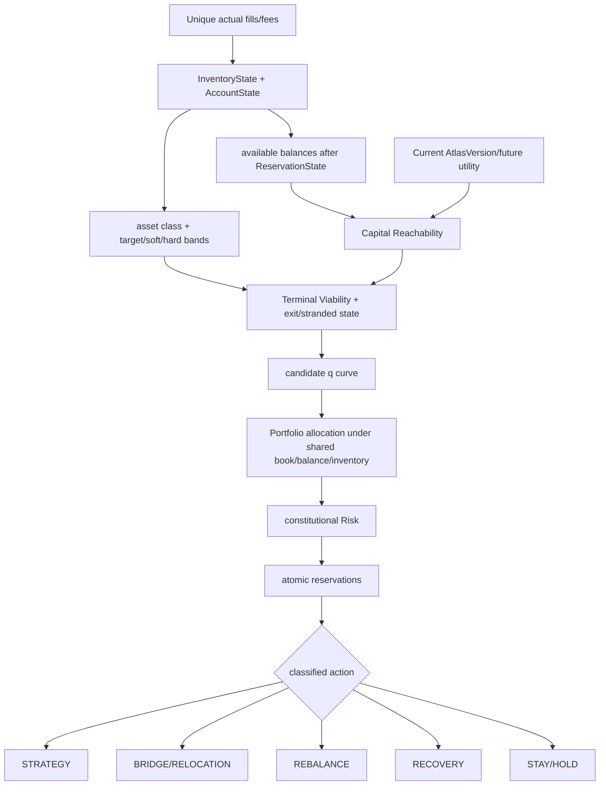

# Capital and Inventory Pipeline

`DOCUMENTATION STATUS: AWAITING HUMAN REVIEW`

Physical capacity is the intersection of available balance, available/reserved book capacity, hard future inventory, Risk, model/execution support, `Q_validated` and Capability scope. `q*=0` when the feasible set is empty. More capital cannot widen evidence or safety.

Soft inventory penalties rank eligible actions; hard bands remove unsafe actions. Sizing chooses total exposure; Slicing implements the fixed amount. Portfolio allocation jointly handles shared constraints but never overrides Risk. Bridge/relocation is a slower Atlas-supported decision against STAY; Rebalance restores desired inventory; Recovery addresses an existing exposure. Accounting preserves all classifications.
