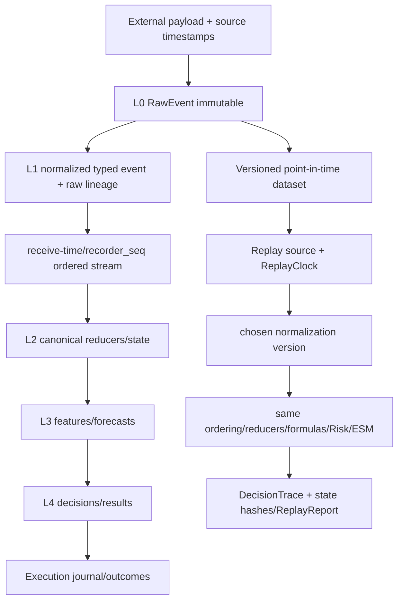

# Data and Replay Pipeline

`DOCUMENTATION STATUS: AWAITING HUMAN REVIEW`

Phase 08 clarifies that captured ordering in one fixed context is ascending `recorder_seq`. Receive monotonic time/source priority may act only before sequence assignment; exchange time never replaces bot-knowledge order. Cross-recorder merge requires an explicit versioned policy.

`RunManifest` pins run/mode, build/config, optional dataset, models, FormulaVersion, event schemas, start and seed. DecisionTrace retains ordered decisions, order intents, state transitions and Risk decisions. Complete identical inputs must produce identical trace/hash regardless of worker scheduling.

No lookahead means no later event, feature, model, timer, checkpoint content or preloaded buffer is visible at replay T. Modern-on-old artifacts are labeled counterfactual, never Historical Truth. Recorder remains non-blocking and its quality/backpressure is explicit.
