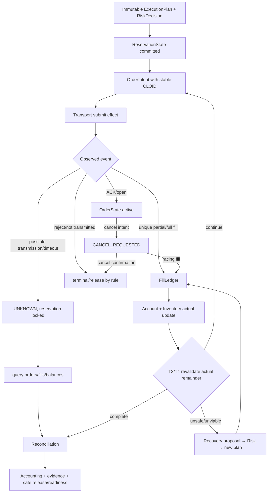

# Execution Pipeline Map

`DOCUMENTATION STATUS: REBUILD IN PROGRESS`

`SubmitOrder` is an effect request, not proof. `SENT` may already have executed. Cancel request does not remove risk. Actual fills alone update inventory and determine the next leg. Partial fills, `DUST_EXPOSURE` and `PendingIntermediateBuffer` remain explicit exposure.

TT/MT/TTT/MTT vary plan structure and order role, not truth semantics. TM/MM stay default-disabled. Transport is mode-specific but reducer, reservation, state-machine, Recovery and accounting contracts remain the same.
