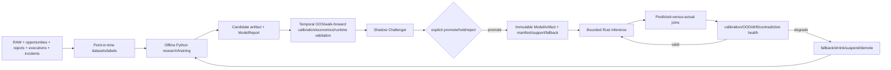

# Model and Calibration Pipeline

`DOCUMENTATION STATUS: REBUILD IN PROGRESS`

Targets must be observable and labelable before models: Opportunity/Edge, survival/correction/capture, maker fill/time/adverse selection, response, Recovery loss, `Q_validated`, Bridge utility and infra economics. Failed/rejected/censored episodes remain in evidence.

Champion/Challenger is governed per exact market/mode/q/horizon/regime/artifact/infra scope. Initial safe baselines are deterministic formulas, constant/simple empirical survival, F0/F1, STAY and zero/conservative q. Advanced ML, dense response and explicit agents do not block bootstrap.

Artifacts re-enter production only through Model and Capability promotion. Runtime cannot train itself, fetch an unpinned model or silently change formula/model/config versions. Persistent supported Live contradiction outranks Replay and can demote immediately.
