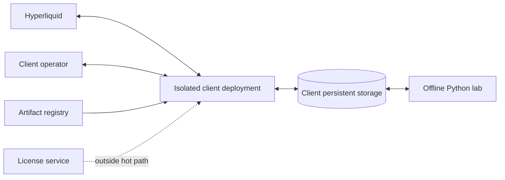

# System Context Model

`DOCUMENTATION STATUS: AWAITING HUMAN REVIEW`

## Actors and boundaries

| Actor/system | Sends to client deployment | Receives from client deployment | Trust/authority boundary |
|---|---|---|---|
| Hyperliquid | Market, metadata, account, order/fill/balance observations | Signed protected order/query/cancel effects | Authoritative economic observations; external schema still validated |
| Client operator | Local config, approvals and `botctl` commands | Status, diagnostics, local/redacted evidence | May tighten policy; cannot bypass constitutional Risk |
| Artifact/release registry | Verified OCI image/digest, SBOM/signature provenance | Optional pull/audit metadata | Software provenance only; no trading permission |
| License service | Signed commercial entitlement | Minimal license request/health | Outside hot path; no custody, Risk or Recovery authority |
| Offline Python lab | Promoted model/calibration candidates | Point-in-time client-controlled datasets/exports | No synchronous Live decision or signer access |
| Client persistent storage | Config/secrets/state/data/log input | RAW, journal, checkpoints, evidence | Reconstruction support; not parallel mutable economic truth |

## System boundary decisions

- One deployment owns one account/signer/capital execution context.
- Initial feed is public; a node is a Future economic gate, not a second Core.
- Vendor systems never hold client exchange secrets or decide/custody orders.
- Runtime is one modular Rust process plus bounded tasks/workers; Python is offline.
- Current same-venue spot capability and Future venue/transports share identifiers/contracts without sharing activation.

Primary sources: domain masters 03–19 and [00 Master Architecture](../../00_MASTER_ARCHITECTURE.md).
