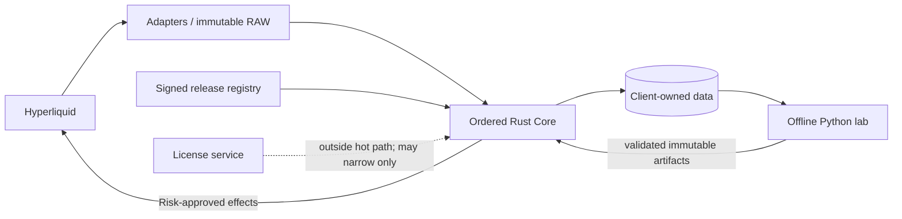
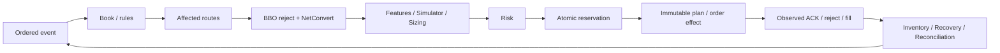

# Architecture Review

`DOCUMENTATION STATUS: AWAITING HUMAN REVIEW`

## Context and runtime

The baseline is one client-isolated Rust modular monolith with bounded async work and one logical commit boundary. External I/O translates payloads/effects; it does not own domain truth or Risk permission.

## Decision path

The apparent return is an event-cycle boundary, not a synchronous dependency cycle. Background workers return immutable version-tagged results; stale results are discarded or revalidated.

BBO is explicitly C1 state validity, C2 proved conservative reject, C3 FastL1 eligibility and C4 heuristic priority. Full-L2 QF-016 remains the economic oracle; FastL1 must be exactly equal and falls back when ineligible. A dense `pair_to_routes` representation remains generation-local implementation detail. Rust is baseline; lock-free and C++ remain evidence-gated.

## Critical state ownership

| State | Single logical owner | Readers | Persistence | Reconstruction |
|---|---|---|---|---|
| Book | Book reducer | Graph, Formula, Simulator, Risk, Execution | ordered market events + checkpoint | replay ordered market events |
| Metadata/Fee/Precision | respective reducers | Graph, Formula, Sizer, Execution | effective-time events/artifacts | point-in-time rules |
| Graph/routes | Graph/Route commit owner | Opportunity, Atlas, Capital, Replay | deterministic metadata build | historical metadata |
| Feature | Feature reducer | Participants, Simulator, Risk | ordered state + FormulaVersion | deterministic reduction |
| Account | Account reducer under coordinator | Inventory, Reservation, Risk, Execution | account/reconciliation events | captured account evidence |
| Inventory | Inventory reducer | Capital, Sizer, Portfolio, Risk, Accounting | unique fills + reconciliation | FillLedger/account evidence |
| Reservation | Reservation Engine | Risk, Capital, Execution, Reconciliation | lifecycle events | deterministic reservation replay |
| Risk | Risk Engine | Sizer, Execution, Recovery, Operations | decisions plus pinned references | run inputs |
| Execution | Execution Coordinator | Risk, Recovery, Accounting, Operations | intent/order/fill journal | ordered execution evidence |
| Recovery | Recovery reducer | Risk, Execution, Accounting, Operations | exposure/recovery events | actual or mode-declared events |
| Reconciliation | Reconciliation reducer | readiness, Risk, Inventory, Operations | orders→fills→balances evidence | captured exchange evidence |
| Atlas | Atlas aggregator | HWC, Capital, Risk, research | immutable eligible evidence/version | point-in-time evidence |
| Capability | Capability Manager | Deployment, Risk, Execution, Operations | signed immutable manifest | pinned manifest |
| Model activation | Model Artifact Manager | Participants, Simulator, Risk, Replay | immutable hash-addressed artifact | manifest-pinned artifact |
| Recorder sequence | Recorder coordinator | Operations, Validation | control records/chunks | recorder-control evidence |

PASS 14 result: 0 duplicate critical owners, 0 unowned critical states and an acyclic synchronous decision path. Review the authoritative [Master Architecture](../00_MASTER_ARCHITECTURE.md) and [PASS 14 report](../_analysis/pass14_cross_domain_consistency/PASS14_FINAL_REPORT.md) for detail.

CORR-06 adds no owner. `InfraProfile` is immutable research evidence and priority policy is a typed treatment; neither becomes a state writer, execution authority or production dependency.

The async/concurrency finalization classifies responsibilities C0–C5. External I/O is asynchronous; full L2/small q-grid remain inline initially; expensive pure snapshot work may use bounded workers; disk/telemetry are background; research is offline. Only C0 commits after current-version revalidation, Risk and Reservation. Worker completion never sets economic priority. `BATCH_SELECT` and deterministic `EARLY_COMMIT` remain pending Replay + Shadow comparison. See [Architecture spec 14](../deep-specs/architecture/14_ASYNC_CONCURRENCY_AND_ORDERED_COMMIT.md).
